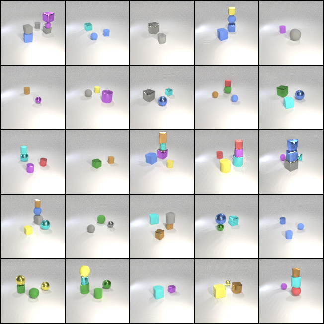
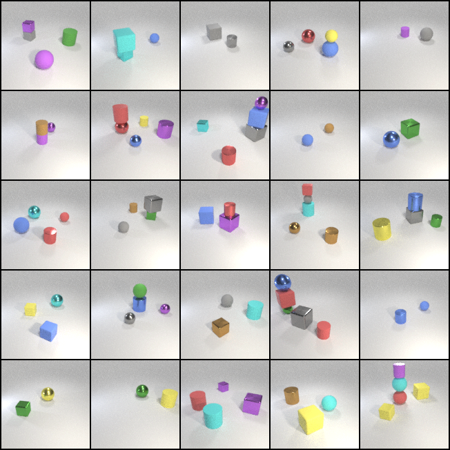
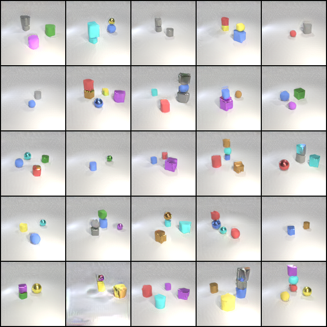

# Learning to Compose Visual Relations

This is the pytorch codebase for the **NeurIPS 2021 Spotlight** paper 
[Learning to Compose Visual Relations](https://composevisualrelations.github.io/).


## Demo
### Image Generation Demo
Please use the following command to generate images on the CLEVR dataset. Please use `--num_rels` to control the input relational descriptions.

```
python demo.py --checkpoint_folder ./checkpoint --model_name clevr --output_folder ./ --dataset clevr \
--resume_iter best --batch_size 25 --num_steps 80 --num_rels 1 --data_folder ./data --mode generation
```

GIF          |  Final Generated Image
:-------------------------:|:-------------------------:
  |  

### Image Editing Demo

Please use the following command to edit images on the CLEVR dataset. Please use `--num_rels` to control the input relational descriptions.
```
python demo.py --checkpoint_folder ./checkpoint --model_name clevr --output_folder ./ --dataset clevr \
--resume_iter best --batch_size 25 --num_steps 80 --num_rels 1 --data_folder ./data --mode editing
```

Input Image | GIF          |  Final Edited Image
:-------------------------:|:-------------------------:|:-------------------------:
  |   |  


----------------------------------------------------------


## Training

### Data Preparation

Please utilize the following [data link](https://www.dropbox.com/sh/8o3rah09x1vmmw5/AABmr16V5BFZc3sv1axDr_nYa?dl=0)
to download the CLEVR data utilized in our experiments. 
Then place all data files under ``./data`` folder.
Downloads for additional datasets and precomputed feature files will be posted soon. 
Feel free to raise an issue if there is a particular dataset you would like to download.


### Model Training

To train your own model, please run following command. 
Please use `--dataset` to train your model on different datasets, e.g. `--dataset clevr`.
```
python -u train.py --cond --dataset=${dataset} --exp=${dataset} --batch_size=10 --step_lr=300 \
--num_steps=60 --kl --gpus=1 --nodes=1 --filter_dim=128 --im_size=128 --self_attn \
--multiscale --norm --spec_norm --slurm --lr=1e-4 --cuda --replay_batch \
--numpy_data_path ./data/clevr_training_data.npz
```

----------------------------------------------------------


## Evaluation
To evaluate our model, you can use your own trained models or download the pre-trained models `model_best.pth` from 
`${dataset}_model` folder from [link](https://www.dropbox.com/sh/8o3rah09x1vmmw5/AABmr16V5BFZc3sv1axDr_nYa?dl=0) and put it under the project folder `./checkpoints/${dataset}`.
Only `clevr_model` is currently available. More pretrained-models will be posted soon.

### Evaluate Image Generation Results Using the Pretrained Classifiers

Please use the following command to generate images on the test set first.
Please use `--dataset` and `--num_rels` to control the dataset and
the number of input relational descriptions. Note that `1 <= num_rels <= 3`.

```
python inference.py --checkpoint_folder ./checkpoints --model_name ${dataset} \
--output_folder ./${dataset}_gen_images --dataset ${dataset} --resume_iter best \
--batch_size 32 --num_steps 80 --num_rels ${num_rels} --data_folder ./data --mode generation
```

In order to evaluate the binary classification scores of the generated images, you can
train one binary classifier or download a pretrained one from [link](https://www.dropbox.com/sh/8o3rah09x1vmmw5/AABmr16V5BFZc3sv1axDr_nYa?dl=0)
under the `binary_classifier` folder.

To train your own binary classifier, please use following command:
```
python train_classifier.py --train --spec_norm --norm \
--dataset ${dataset} --lr 3e-4 --checkpoint_dir ./binary_classifier
```

Please use following command to evaluate on generated images conditioned on selected number of relations.
Please use `--num_rels` to specify the number of relations.

```
python classification_scores.py --dataset ${dataset} --checkpoint_dir ./binary_classifier/ \
--data_folder ./data --generated_img_folder ./${dataset}_gen_images/num_rels_${num_rels} \
--mode generation --num_rels ${num_rels}
```


### Evaluate Image Editing Results Using the Pretrained Classifiers

Please use the following command to edit images on the test set first.
Please use `--dataset` and `--num_rels` to select the dataset and
the number of input relational descriptions.

```
python inference.py --checkpoint_folder ./checkpoints --model_name ${dataset} \
--output_folder ./${dataset}_edit_images --dataset ${dataset} --resume_iter best \
--batch_size 32 --num_steps 80 --num_rels 1 --data_folder ./data --mode editing
```

To evaluate classification scores of image editing results, please change the `--mode` to `editing`.

```
python classification_scores.py --dataset ${dataset} --checkpoint_dir ./binary_classifier/ \
--data_folder ./data --generated_img_folder ./${dataset}_edit_images/num_rels_${num_rels} \
--mode editing --num_rels ${num_rels}
```


------------------------------------------------------------------------------------------------------------------------
### Acknowledgements
The code for training EBMs is from https://github.com/yilundu/improved_contrastive_divergence.


------------------------------------------------------------------------------------------------------------------------
### Citation
Please consider citing our papers if you use this code in your research:
```
@article{liu2021learning,
  title={Learning to Compose Visual Relations},
  author={Liu, Nan and Li, Shuang and Du, Yilun and Tenenbaum, Josh and Torralba, Antonio},
  journal={Advances in Neural Information Processing Systems},
  volume={34},
  year={2021}
}
```

